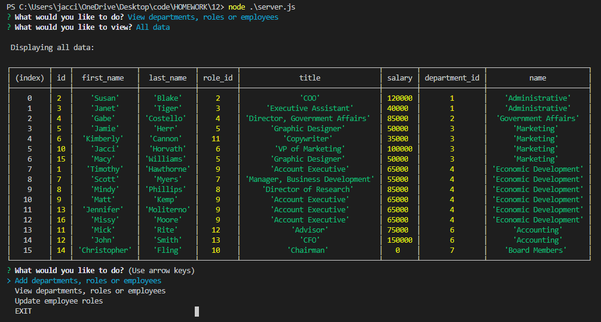

# Employee Tracker

## Description
In this repository you will find a command-line application that provides a solution for managing a company's employees using [Node.js](https://nodejs.org/en/) and the [Inquirer](https://www.npmjs.com/package/inquirer) and [MySQL](https://www.npmjs.com/package/mysql) packages.

The application enables users to:
* Add departments, roles or employees
* View departments, roles or employees
* Update employee roles


## Table of Contents
* [Installation](#installation)
* [Usage](#usage)
* [Contributing](#contributing)
* [Questions](#questions)
* [License](#license)


## Installation
To begin using this application, the user must first open the terminal. Next, the user must install all dependencies by running the following command:

```bash
npm install
```


## Usage
This application will be invoked by running the following command:

```bash
node server.js
```

Once invoked, the user will be presented the main menu, where a variety of options are available. Once a selection is made, the user will be prompted with a series of questions. Each question requires an answer and can be submitted by pressing enter.

The application then takes the user input to dynamically update a MySQL database that houses all employee information.



[Watch a video walkthrough of the application.](https://drive.google.com/file/d/1Adq-F7TakU5G9cOWvSWisWrrTM4EP3xt/view?usp=sharing)


## Contributing
* [Node.js](https://nodejs.org/en/)
* [Inquirer](https://www.npmjs.com/package/inquirer)
* [MySQL](https://www.npmjs.com/package/mysql)
* [npm](https://www.npmjs.com/)
* [Shields.io](https://shields.io/)


## Questions
Find [jaccihorvath on GitHub](https://github.com/jaccihorvath) or email [jacci@gmail.com](mailto:jacci@gmail.com) with additional questions.


## License
Copyright (c) [jaccihorvath](https://github.com/jaccihorvath).
Licensed under the MIT License.
